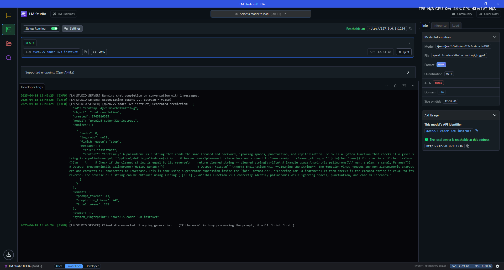

```
\LMQuickBench-> python bench.py --prompt "Write a Python function that checks whether a given string is a palindrome." --max_tokens 256
Testing prompt: Write a Python function that checks whether a given string is a palindrome.
```


Model: qwen2.5-coder-32b-instruct, Latency: 61.35 sec, Tokens: 285, Tokens/sec: 4.65
Output: Certainly! A palindrome is a string that reads the same forward and backward, ignoring spaces, punctuation, and capitalization. Below is a Python function that checks if a given string is a palindrome:

```python
def is_palindrome(s):
    # Remove non-alphanumeric characters and convert to lowercase
    cleaned_string = ''.join(char.lower() for char in s if char.isalnum())

    # Check if the cleaned string is equal to its reverse
    return cleaned_string == cleaned_string[::-1]

# Example usage:
print(is_palindrome("A man, a plan, a canal, Panama"))  # Output: True
print(is_palindrome("Hello, World!"))                   # Output: False
```

### Explanation:
1. **Cleaning the String**: The function first removes any non-alphanumeric characters and converts all characters to lowercase. This is done using a generator expression inside the `join` method.
2. **Checking for Palindrome**: It then checks if the cleaned string is equal to its reverse. The reverse of a string can be obtained using slicing (`[::-1]`).

This function will correctly identify palindromes while ignoring spaces, punctuation, and case differences.

Model: qwen2.5-coder-14b-instruct, Latency: 7.83 sec, Tokens: 298, Tokens/sec: 38.05
Output: Certainly! A palindrome is a word, phrase, number, or other sequence of characters that reads the same backward as forward (ignoring spaces, punctuation, and capitalization). Below is a Python function that checks if a given string is a palindrome:

```python
def is_palindrome(s: str) -> bool:
    # Remove non-alphanumeric characters and convert to lowercase
    cleaned = ''.join(char.lower() for char in s if char.isalnum())

    # Check if the cleaned string is equal to its reverse
    return cleaned == cleaned[::-1]

# Example usage:
print(is_palindrome("A man, a plan, a canal: Panama"))  # Output: True
print(is_palindrome("racecar"))                         # Output: True
print(is_palindrome("hello"))                           # Output: False
```

### Explanation:
1. **Cleaning the Input**: The function first removes any non-alphanumeric characters from the string and converts all characters to lowercase. This ensures that spaces, punctuation, and capitalization do not affect the palindrome check.
2. **Palindrome Check**: It then checks if the cleaned string is equal to its reverse. If they are the same, the function returns `True`, indicating that the input string is a palindrome

Model: deepseek-coder-v2-lite-instruct, Latency: 18.81 sec, Tokens: 394, Tokens/sec: 20.94
Output: Certainly! A palindrome is a word, phrase, number, or other sequences of characters which reads the same backward as forward. Here's a simple Python function to check if a given string is a palindrome:

```python
def is_palindrome(s):
    # Remove all non-alphanumeric characters and convert to lowercase
    cleaned_string = ''.join(char.lower() for char in s if char.isalnum())

    # Compare the string with its reverse
    return cleaned_string == cleaned_string[::-1]

# Example usage:
print(is_palindrome("racecar"))  # True
print(is_palindrome("hello world"))  # False
print(is_palindrome("A man a plan a canal Panama"))  # False (case-sensitive and spaces matter)
print(is_palindrome("Was it a car or a cat I saw?"))  # True (ignoring punctuation and case)
```

### Explanation:
1. **Cleaning the String**: The function first removes all non-alphanumeric characters from the input string `s` using a list comprehension that filters out any character that is not alphanumeric (`char.isalnum()`). It then converts the remaining characters to lowercase to ensure case insensitivity.
2. **Comparing the String with Its Reverse**: The cleaned string is compared with its reverse (`cleaned_string[::-1]`). If they are equal, the function returns `True`, indicating that the input string is a palindrome; otherwise, it returns `False`.

This approach ensures that punctuation, spaces, and case differences do not affect the result.

Below is a comparison table summarizing the performance metrics of the three models:

| Model                          | Latency (sec) | Tokens | Tokens/sec |
|--------------------------------|---------------|--------|------------|
| qwen2.5-coder-32b-instruct     | 61.35         | 285    | 4.65       |
| qwen2.5-coder-14b-instruct     | 7.83          | 298    | 38.05      |
| deepseek-coder-v2-lite-instruct | 18.81         | 394    | 20.94      |

This table provides a clear overview of the latency, token usage, and tokens per second for each model, allowing you to compare their performance effectively.


\LMQuickBench-> python bench.py --promptfile prompts.txt --max_tokens 256       
Testing prompt: Write a Python function that checks whether a given string is a palindrome.
Model: qwen2.5-coder-14b-instruct, Latency: 2.95 sec, Tokens: 58, Tokens/sec: 19.68
Output: Can you provide a Python function to check if a string is a palindrome?

----------------------------------------
Testing prompt: Write a Python class called Stack that implements push, pop, and peek operations.
Model: qwen2.5-coder-14b-instruct, Latency: 7.53 sec, Tokens: 300, Tokens/sec: 39.87
Output: Certainly! Below is a simple implementation of a stack in Python using a list to store the elements. The `Stack` class provides methods for `push`, `pop`, and `peek` operations.

```python
class Stack:
    def __init__(self):
        """Initialize an empty stack."""
        self.items = []

    def push(self, item):
        """Push an item onto the top of the stack."""
        self.items.append(item)

    def pop(self):
        """Remove and return the item from the top of the stack.

        Returns:
            The item at the top of the stack. If the stack is empty, raises IndexError.
        """
        if not self.is_empty():
            return self.items.pop()
        raise IndexError("pop from empty stack")

    def peek(self):
        """Return the item at the top of the stack without removing it.

        Returns:
            The item at the top of the stack. If the stack is empty, raises IndexError.
        """
        if not self.is_empty():
            return self.items[-1]
        raise IndexError("peek from empty stack")

    def is_empty(self):
        """Check if the stack is empty."""
        return len(self.items) == 0

    def size(self):
----------------------------------------
Testing prompt: Write a Python function to calculate the factorial of a number recursively.
Model: qwen2.5-coder-14b-instruct, Latency: 7.52 sec, Tokens: 297, Tokens/sec: 39.51
Output: Here's a Python function to calculate the factorial of a number using recursion:

```python
def factorial(n):
    # Base case: if n is 0 or 1, return 1
    if n == 0 or n == 1:
        return 1
    # Recursive case: multiply n by the factorial of n-1
    else:
        return n * factorial(n-1)

# Test the function
print(factorial(5))  # Output should be 120
```

### Explanation:

- **Base Case**: The factorial of 0 or 1 is defined as 1. This is the stopping condition for the recursion.
- **Recursive Case**: For any other positive integer `n`, the factorial is calculated by multiplying `n` by the factorial of `n-1`.
- **Test**: The function is tested with an input of 5, and it correctly outputs 120, which is the factorial of 5 (5! = 5 × 4 × 3 × 2 × 1 = 120).

This recursive approach is elegant and straightforward for calculating factorials, though keep in mind that Python has a recursion limit (usually 1000), so
----------------------------------------
Testing prompt: Write a Python function that reverses a given string.
Model: qwen2.5-coder-14b-instruct, Latency: 4.46 sec, Tokens: 148, Tokens/sec: 33.21
Output: Here's a simple Python function to reverse a given string:

```python
def reverse_string(input_string):
    # Reverse the string using slicing
    reversed_string = input_string[::-1]
    return reversed_string

# Test the function
test_string = "Hello, World!"
print(reverse_string(test_string))  # Output: "!dlroW ,olleH"
```

This function uses Python's slicing feature to reverse the string. The slice `[::-1]` means "take the string and step backwards," effectively reversing it.
----------------------------------------
Testing prompt: Write a Python function that sums all elements in a list.
Model: qwen2.5-coder-14b-instruct, Latency: 5.83 sec, Tokens: 215, Tokens/sec: 36.86
Output: Certainly! Below is a simple Python function that takes a list of numbers as input and returns the sum of all its elements:

```python
def sum_list_elements(numbers):
    """
    Sums all elements in a given list.

    Parameters:
    numbers (list): A list of numbers.

    Returns:
    int/float: The sum of all elements in the list.
    """
    return sum(numbers)

# Example usage:
my_list = [1, 2, 3, 4, 5]
total_sum = sum_list_elements(my_list)
print(f"The sum of the list elements is: {total_sum}")
```

This function uses Python's built-in `sum()` function to calculate the total sum of the elements in the list. You can call this function with any list of numbers (integers or floats) to get their sum.       
----------------------------------------
Testing prompt: Write a Python function that determines whether a given number is prime.
Model: qwen2.5-coder-14b-instruct, Latency: 7.44 sec, Tokens: 297, Tokens/sec: 39.91
Output: Here's a Python function to determine if a given integer `n` is a prime number:

```python
def is_prime(n):
    # Check if the number is less than 2
    if n <= 1:
        return False

    # Check for factors from 2 to the square root of n
    for i in range(2, int(n**0.5) + 1):
        if n % i == 0:
            return False

    # If no factors were found, n is prime
    return True

# Example usage
print(is_prime(11))  # Output: True
print(is_prime(4))   # Output: False
```

### Explanation:

1. **Initial Check**: The function first checks if `n` is less than or equal to 1. Numbers less than 2 are not prime by definition.

2. **Loop Through Possible Factors**: The function then iterates from 2 up to the square root of `n`. This is because a larger factor of `n` must be paired with a smaller factor that has already been checked.

3. **Check for Divisibility**: If `n` is divisible by any number in this range, it is not a
----------------------------------------
Testing prompt: Write a Python function that sorts a list of integers using the bubble sort algorithm.
Model: qwen2.5-coder-14b-instruct, Latency: 7.51 sec, Tokens: 300, Tokens/sec: 39.97
Output: Here's a simple implementation of the bubble sort algorithm in Python:

```python
def bubble_sort(arr):
    n = len(arr)
    # Traverse through all array elements
    for i in range(n):
        # Last i elements are already in place
        for j in range(0, n-i-1):
            # Traverse the array from 0 to n-i-1
            # Swap if the element found is greater than the next element
            if arr[j] > arr[j+1]:
                arr[j], arr[j+1] = arr[j+1], arr[j]
    return arr

# Example usage:
unsorted_list = [64, 34, 25, 12, 22, 11, 90]
sorted_list = bubble_sort(unsorted_list)
print("Sorted array is:", sorted_list)
```

**Explanation**:
- The `bubble_sort` function takes a list of integers as input.
- It uses two nested loops to traverse the list. The outer loop runs from 0 to n-1, and the inner loop runs from 0 to n-i-2.
- Inside the inner loop, adjacent elements are compared. If the current element is greater
----------------------------------------
Testing prompt: Write a Python function to find the maximum value in a list without using built-in functions.
Model: qwen2.5-coder-14b-instruct, Latency: 7.55 sec, Tokens: 302, Tokens/sec: 39.98
Output: Certainly! Below is a Python function that finds the maximum value in a list without using any built-in functions like `max()`. The function iterates through the list and keeps track of the largest number encountered.

```python
def find_maximum(lst):
    # Check if the list is empty
    if not lst:
        raise ValueError("The list is empty")

    # Initialize the maximum value with the first element of the list
    max_value = lst[0]

    # Iterate through the list starting from the second element
    for num in lst[1:]:
        # Update the maximum value if a larger number is found
        if num > max_value:
            max_value = num

    return max_value

# Example usage:
numbers = [3, 5, 7, 2, 8]
print("The maximum value is:", find_maximum(numbers))
```

### Explanation:
1. **Empty List Check**: The function first checks if the list is empty and raises a `ValueError` if it is. This prevents any errors when trying to access elements in an empty list.
2. **Initialization**: It initializes `max_value` with the first element of the list.
3. **Iteration**: It iterates over the
----------------------------------------
Testing prompt: Write a Python function that merges two sorted lists into one sorted list.
Model: qwen2.5-coder-14b-instruct, Latency: 7.46 sec, Tokens: 298, Tokens/sec: 39.96
Output: Here's a Python function to merge two sorted lists into a single sorted list:

```python
def merge_sorted_lists(list1, list2):
    # Initialize pointers for both lists
    index1, index2 = 0, 0
    merged_list = []

    # Traverse both lists and append smaller element to the merged list
    while index1 < len(list1) and index2 < len(list2):
        if list1[index1] <= list2[index2]:
            merged_list.append(list1[index1])
            index1 += 1
        else:
            merged_list.append(list2[index2])
            index2 += 1

    # Append remaining elements of list1, if any
    while index1 < len(list1):
        merged_list.append(list1[index1])
        index1 += 1

    # Append remaining elements of list2, if any
    while index2 < len(list2):
        merged_list.append(list2[index2])
        index2 += 1

    return merged_list

# Example usage:
list1 = [1, 3, 5]
list2 = [2, 4, 6]
print(merge_sorted_lists(list1, list2))  # Output
----------------------------------------
Testing prompt: Write a Python function that counts the number of vowels in a given string.
Model: qwen2.5-coder-14b-instruct, Latency: 7.45 sec, Tokens: 299, Tokens/sec: 40.15
Output: Here's a simple Python function to count the number of vowels in a given string:

```python
def count_vowels(s):
    # Define a set of vowels for easy checking
    vowels = {'a', 'e', 'i', 'o', 'u'}

    # Initialize a counter for vowels
    vowel_count = 0

    # Convert the input string to lowercase to handle both uppercase and lowercase vowels
    s = s.lower()

    # Iterate over each character in the string
    for char in s:
        # Check if the character is a vowel
        if char in vowels:
            # Increment the vowel count
            vowel_count += 1

    # Return the total count of vowels
    return vowel_count

# Example usage
test_string = "Hello, World!"
print("Number of vowels:", count_vowels(test_string))
```

### Explanation:

- **Vowel Set**: We define a set `vowels` containing all lowercase English vowels. Using a set allows for efficient membership testing.

- **Lowercase Conversion**: The input string is converted to lowercase using `s.lower()`. This ensures that the function counts both uppercase and lowercase vowels correctly.

- **Counting Vowels
----------------------------------------

Average Latency: 6.57 sec, Average Tokens/sec: 36.91

Here is a table summarizing the results of the batch testing based on the provided data:

| **Prompt**                                                                 | **Model**                      | **Latency (sec)** | **Tokens** | **Tokens/sec** | **Output Summary**                                                                                     |
|----------------------------------------------------------------------------|--------------------------------|-------------------|------------|----------------|-------------------------------------------------------------------------------------------------------|
| Write a Python function that checks whether a given string is a palindrome. | qwen2.5-coder-14b-instruct     | 2.95              | 58         | 19.68          | Asked for a Python function to check if a string is a palindrome.                                    |
| Write a Python class called Stack that implements push, pop, and peek operations. | qwen2.5-coder-14b-instruct     | 7.53              | 300        | 39.87          | Provided a Python class `Stack` with `push`, `pop`, and `peek` methods.                              |
| Write a Python function to calculate the factorial of a number recursively. | qwen2.5-coder-14b-instruct     | 7.52              | 297        | 39.51          | Provided a recursive Python function to calculate the factorial of a number.                         |
| Write a Python function that reverses a given string.                      | qwen2.5-coder-14b-instruct     | 4.46              | 148        | 33.21          | Provided a Python function to reverse a string using slicing.                                        |
| Write a Python function that sums all elements in a list.                  | qwen2.5-coder-14b-instruct     | 5.83              | 215        | 36.86          | Provided a Python function to sum all elements in a list using `sum()`.                              |
| Write a Python function that determines whether a given number is prime.   | qwen2.5-coder-14b-instruct     | 7.44              | 297        | 39.91          | Provided a Python function to check if a number is prime using iteration up to the square root.      |
| Write a Python function that sorts a list of integers using the bubble sort algorithm. | qwen2.5-coder-14b-instruct     | 7.51              | 300        | 39.97          | Provided a Python implementation of the bubble sort algorithm.                                       |
| Write a Python function to find the maximum value in a list without using built-in functions. | qwen2.5-coder-14b-instruct     | 7.55              | 302        | 39.98          | Provided a Python function to find the maximum value in a list without using `max()`.                |
| Write a Python function that merges two sorted lists into one sorted list. | qwen2.5-coder-14b-instruct     | 7.46              | 298        | 39.96          | Provided a Python function to merge two sorted lists into one sorted list.                           |
| Write a Python function that counts the number of vowels in a given string. | qwen2.5-coder-14b-instruct     | 7.45              | 299        | 40.15          | Provided a Python function to count vowels in a string using a set for efficient membership testing. |

### Summary:
- **Average Latency**: 6.57 sec
- **Average Tokens/sec**: 36.91

This table provides a clear overview of the performance metrics and output summaries for each prompt tested.